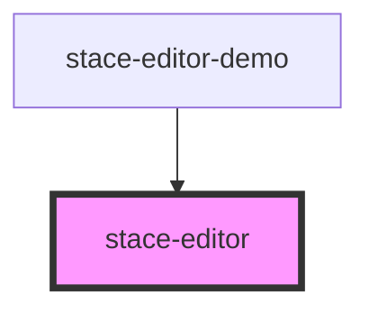

# stace-editor

<!-- Auto Generated Below -->

## Properties

| Property                 | Attribute                  | Description | Type      | Default        |
| ------------------------ | -------------------------- | ----------- | --------- | -------------- |
| `autoUpdateContent`      | `auto-update-content`      |             | `boolean` | `true`         |
| `durationBeforeCallback` | `duration-before-callback` |             | `number`  | `0`            |
| `mode`                   | `mode`                     |             | `string`  | `"javascript"` |
| `options`                | `options`                  |             | `any`     | `{}`           |
| `readOnly`               | `read-only`                |             | `boolean` | `false`        |
| `text`                   | `text`                     |             | `string`  | `""`           |
| `theme`                  | `theme`                    |             | `string`  | `"ambiance"`   |
| `timeoutSaving`          | `timeout-saving`           |             | `number`  | `0`            |

## Events

| Event        | Description | Type               |
| ------------ | ----------- | ------------------ |
| `textChange` |             | `CustomEvent<any>` |

## Methods

### `getEditor() => Promise<Editor>`

#### Returns

Type: `Promise<Editor>`

## Dependencies

### Used by

 - [stace-editor-demo](../stace-editor-demo)

### Graph

----------------------------------------------

*Built with [StencilJS](https://stenciljs.com/)*
